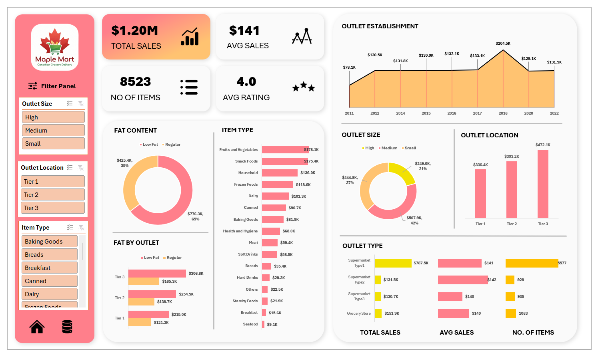
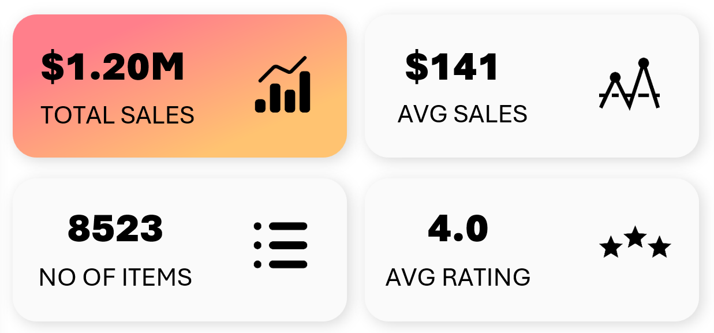
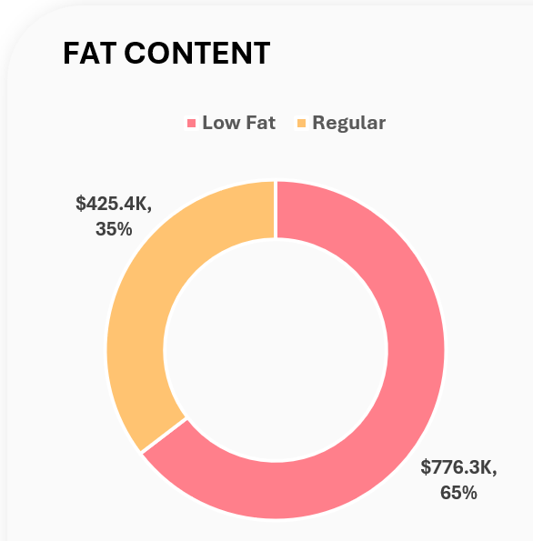
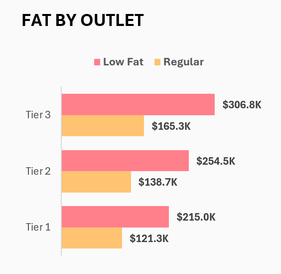
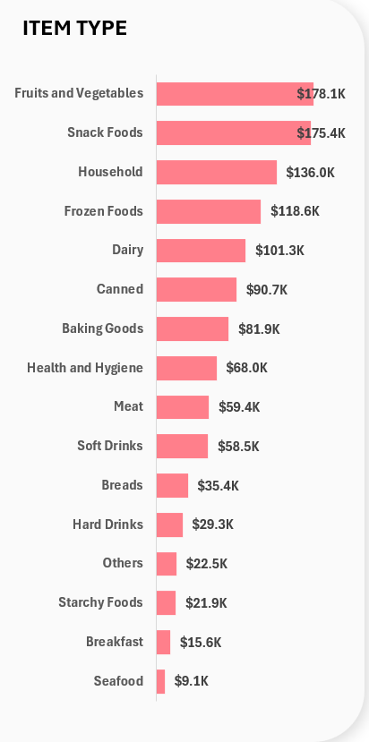
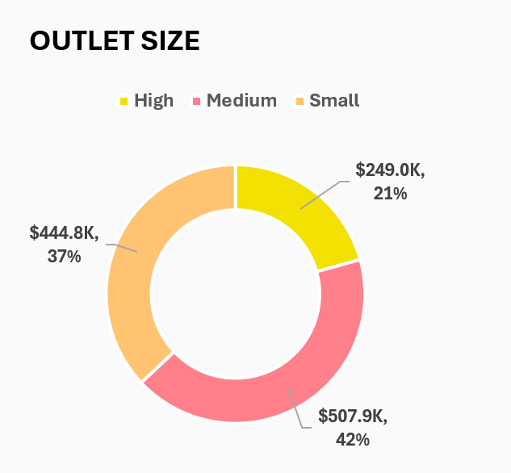
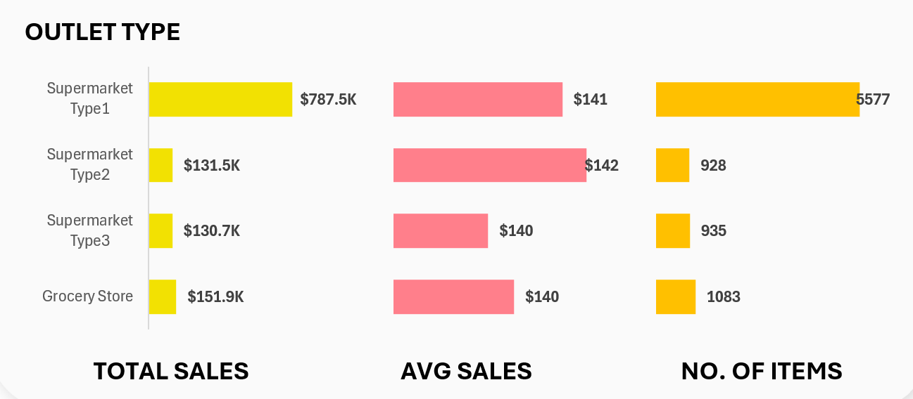

  

# Maple Mart Grocery Outlet Performance Analysis

## 1. Background and Overview

Maple Mart is a fictional Canadian online first grocery and essentials delivery company. Customers place orders through the Maple Mart app or website and deliveries are fulfilled through a nationwide network of physical outlets. These outlets vary in size, location tier and format, ranging from large supermarket hubs to compact partner grocery stores.

Leadership requested an analysis to understand which outlet characteristics and product categories contribute most to revenue. The goal is to identify performance patterns that can support decisions in assortment optimization, outlet expansion and operational planning.

This project analyzes item level sales data containing `8523` records. The analysis examines sales by:

- product health profile (Low Fat vs Regular)
- product category
- outlet location tier (Tier 1 urban cores, Tier 2 mid sized areas, Tier 3 emerging markets)
- outlet size (Small, Medium, High capacity)
- outlet format (Supermarket Type1, Type2, Type3, Grocery Store)
- outlet establishment year

The results provide a complete view of which segments of Maple Mart’s network drive the most value and where strategic opportunities exist for growth.

## 2. Data Structure Overview

The cleaned dataset contains a single structured Excel table representing item level sales. Each row corresponds to a specific product sold at a specific outlet.

| Column Name               | Description                                                                                 |
| ------------------------- | ------------------------------------------------------------------------------------------- |
| Item Fat Content          | Nutritional profile of the product. Standardized to Low Fat and Regular                     |
| Item Identifier           | Unique Maple Mart SKU                                                                       |
| Item Type                 | Product category such as Frozen Foods, Snack Foods, Fruits and Vegetables etc.              |
| Outlet Establishment Year | Year when the fulfillment outlet began operations in Canada                                 |
| Outlet Identifier         | Unique ID assigned to each outlet in the network                                            |
| Outlet Location Type      | Internal tier classification. Tier 1 large metro, Tier 2 mid sized, Tier 3 emerging markets |
| Outlet Size               | Outlet capacity class Small Medium High                                                     |
| Outlet Type               | Store format Supermarket Type1, Type2, Type3 or partner Grocery Store                       |
| Item Visibility           | Relative on shelf or in app prominence score                                                |
| Item Weight               | Weight of the packaged item in kilograms                                                    |
| Total Sales               | Revenue generated for the specific item line                                                |
| Rating                    | Customer rating on a five point scale                                                       |
| Sr. no                    | Sequential row counter used for item level counts in pivot tables                           |

The dataset can be conceptually viewed as linking two logical domains:

- Products
- Outlets

For full technical details, see the accompanying files

- `data_dictionary.md`
- `cleaning_steps.md`

## 3. Excel Workflow and Dashboard Overview

The analysis was completed in a structured Excel workflow that separates raw data, preparation work and the final dashboard.

### Dashboard Preview

### Raw Data

This sheet contains the cleaned version of the original `Raw Data.csv` file.
Processing steps included standardizing Item Fat Content values, validating numeric fields and adding a sequential row counter for item level analysis. The dataset was converted into an Excel Table to enable structured referencing throughout the project.

### Sheets Design

This sheet serves as the analytical workspace. All pivot tables and supporting summaries used for the dashboard were created here, including

- KPI summary
- Sales by Item Fat Content
- Sales by Item Fat Content and Outlet Location Type
- Sales by Item Type
- Sales by Outlet Establishment Year
- Sales by Outlet Size
- Sales by Outlet Location Tier
- Outlet Type metrics (Total Sales, Average Sales, Item Counts)

These pivot tables feed all visualizations in the final dashboard.

### Dashboard

This is the final presentation layer of the project. It includes interactive slicers and a collection of visuals designed for fast interpretation

- KPI cards for Total Sales, Average Sales, Number of Items and Average Rating
- Area chart showing sales distribution by outlet establishment year
- Donut charts for sales by fat content and outlet size
- Column and bar charts highlighting item type performance and outlet location tier
- Combined outlet type metrics displaying revenue, average sales and item counts

A full screenshot of the dashboard is available in `docs/exported_dashboard_images/dashboard_full.png`.

## 4. Executive Summary

Maple Mart generated approximately **1.20 million** in sales across the dataset, with customer ratings averaging close to **4 out of 5**. **Low Fat** items accounted for about two thirds of total revenue, driven mainly by strong performance in **Fruits and Vegetables** and **Snack Foods**.

**Tier 3** locations contributed the largest share of sales among all outlet location tiers, while **Medium sized outlets** delivered the highest overall revenue. **Supermarket Type1** outlets emerged as Maple Mart’s strongest format, generating more than half of all sales in the sample.

Overall, the analysis highlights clear opportunities to strengthen **health focused assortments**, expand effectively in **Tier 3** regions and refine outlet format strategies to support continued growth.

## 5. Insights Deep Dive

### 5.1 Sales Mix by Product Health Profile

Low Fat products generated about **776 thousand** in revenue, representing roughly sixty five percent of total sales. Regular products contributed around **425 thousand**. This indicates that Maple Mart customers show a strong preference for health focused or diet friendly items. The trend is most pronounced in high volume categories such as Fruits and Vegetables and Snack Foods.

### 5.2 Sales by Outlet Location Tier

Tier 3 locations produced the highest revenue among all tiers, outperforming both Tier 1 and Tier 2 regions. This suggests that Maple Mart’s strongest demand comes from smaller or emerging Canadian markets rather than the largest metropolitan areas. Expansion efforts may benefit from prioritizing Tier 3 regions where adoption appears strongest.

### 5.3 Sales by Item Type

Fruits and Vegetables and Snack Foods are the two leading categories by total sales, together accounting for a major share of revenue. Household items and Frozen Foods follow as mid tier performers. Categories such as Seafood and Breakfast contribute relatively little volume, indicating the presence of niche segments with limited demand.

### 5.4 Outlet Size Performance

Medium sized outlets generated the highest overall revenue at approximately 507 thousand. Small outlets contributed around 444 thousand and High capacity outlets contributed around 249 thousand. Medium outlets appear to be the operational sweet spot, delivering strong performance while balancing cost and capacity.

### 5.5 Outlet Type Metrics

Supermarket Type1 locations contributed about 787 thousand in total sales, making them the strongest format in the network. Grocery Store partner locations contributed around 151 thousand, showing meaningful performance despite smaller scale. Average sales and item counts reflect consistent productivity across formats, with Type1 outlets leading all metrics.

### 5.6 Sales by Outlet Establishment Year

Sales appear relatively stable across establishment years, with newer outlets ramping quickly and contributing significant revenue. The trend indicates that Maple Mart’s expansion strategy is effective and that newly launched outlets reach steady performance levels without long ramp up periods.

## 6. Recommendations and Business Impact

### Strengthen health focused assortment

Low Fat products consistently outperform Regular products and drive the majority of Maple Mart’s revenue. Expanding reduced fat and health oriented SKUs, especially within Fruits and Vegetables and Snack Foods, can help reinforce Maple Mart’s positioning for health conscious customers.

### Prioritize Tier 3 markets for expansion

Tier 3 locations deliver the highest revenue among all location tiers. Marketing investments, promotional trials and new outlet launches should prioritize these regions, where Maple Mart is already seeing strong adoption and lower competitive saturation.

### Focus development on Medium sized outlets

Medium outlets generate the highest total sales and appear to be the optimal balance of floor space, cost and operational efficiency. Future rollout plans and performance improvement initiatives should treat Medium outlets as the core model for expansion.

### Optimize underperforming categories

Lower volume categories such as Seafood and Breakfast could benefit from targeted promotions or strategic reassessment. Maple Mart can test price adjustments, category refreshes or bundled offers to improve performance, or gradually reduce SKUs where demand remains consistently low.

### Build a playbook for partner Grocery Stores

Although smaller in scale, partner Grocery Stores contribute meaningful revenue. Maple Mart can formalize a partner onboarding and performance optimization framework to expand coverage in regions where building owned outlets is less feasible.

## 7. Caveats and Assumptions

### Sample based analysis

The dataset represents a sample of Maple Mart transactions rather than the full company wide data. Insights reflect patterns within this sample and may not capture seasonal variations or regional anomalies.

### Outlet location tiers are internal classifications

Tier 1, Tier 2 and Tier 3 represent Maple Mart’s internal trade area groupings. They do not map directly to official Canadian census regions or metropolitan boundaries.

### Ratings may reflect response bias

Customer ratings skew toward higher values, which may indicate incomplete capture of negative reviews or selective feedback from satisfied customers.

### Item Visibility is an indirect metric

The Item Visibility field is treated as a proxy for shelf or app prominence, but does not reflect marketing spend, search ranking algorithms or featured product placement.

### Monetary values treated as CAD

All revenue figures are interpreted as Canadian dollars for the purpose of this project, although the dataset does not explicitly specify currency.

## 8. Files and Navigation

| Folder/File                                   | Description                                                              |
| --------------------------------------------- | ------------------------------------------------------------------------ |
| `data_raw/Raw Data.csv`                       | Original dataset containing unprocessed item level sales records         |
| `data_clean/MapleMart_Complete_Analysis.xlsx` | Cleaned dataset, pivot tables and the full Excel dashboard               |
| `docs/exported_dashboard_images/`             | PNG exports of the final dashboard and supporting visuals                |
| `docs/data_dictionary.md`                     | Detailed field level documentation for all columns in the dataset        |
| notes_and_scripts/cleaning_steps.md           | Step by step description of all data cleaning actions performed          |
| `README.md`                                   | Full project explanation, insights, recommendations and business context |

## 9. Tools and Skills

This project demonstrates practical Excel based analytics skills including:

- Data cleaning and standardization with Excel Tables
- Pivot table development for multi dimensional analysis
- KPI creation and summary metrics
- Data visualization through charts and slicers
- Interactive dashboard design
- Business interpretation of outlet and product performance data

The analysis reflects typical responsibilities of an entry level data analyst working with operational retail datasets.

## 10. How to Explore the Dashboard

The interactive dashboard is available in the Excel file located in
`data_clean/MapleMart_Complete_Analysis.xlsx`

To explore the visuals

1. Open the workbook and navigate to the Dashboard sheet
2. Use the slicers to filter results by
   - Outlet Location Tier
   - Outlet Size
   - Outlet Type
   - Item Type
3. Review KPI cards and charts to compare performance across different outlet and product segments
4. Refer to the pivot tables in the Sheets Design sheet for underlying values powering each visual

A full image of the dashboard is also available for quick viewing in
`docs/exported_dashboard_images/dashboard_full.png`
